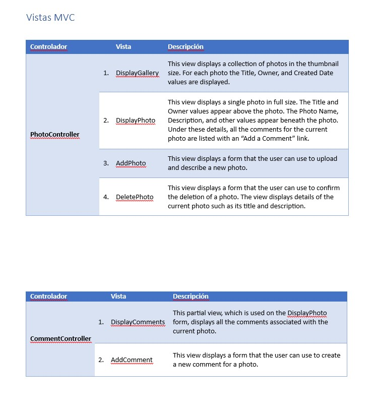

# Module 2: Designing ASP.NET Core MVC Web Applications

## Lab: Designing ASP.NET Core MVC Web Applications

1. **Nombres y apellidos:** Francisco Javier Moreno Quevedo

2. **Fecha:** 06/12/2020

3. **Resumen del Ejercicio:**  Aprender a diseñar una aplicación en ASP.NET Core MVC

4. **Dificultad o problemas presentados y como se resolvieron:** Ninguna

   

- Ejercicio 3: Planning Views

  - Abrimos el documento **DetailedPlanningDocument.docx** y completamos la parte de MVC Views

  - Identificamos los controladores

  - Añadimos las vistas resultantes de cada controlador PhotoController y CommentController en el documento

    

  - 

  - 
  
    

